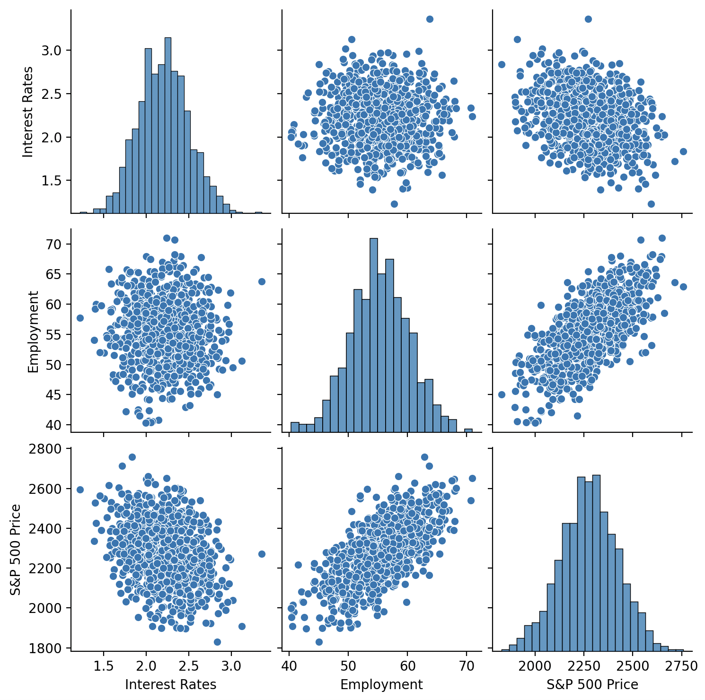
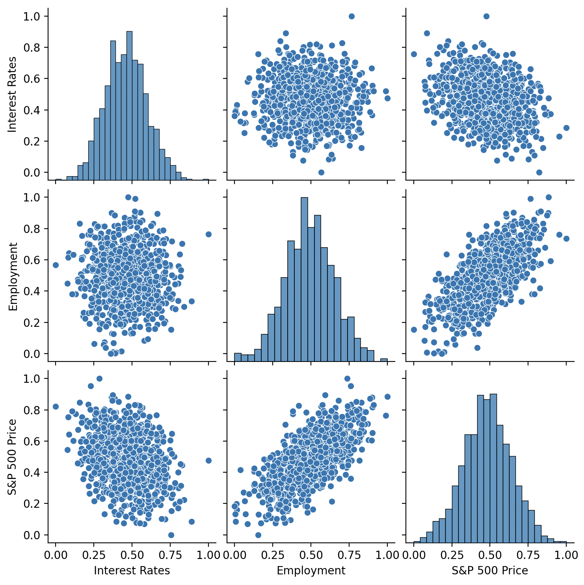
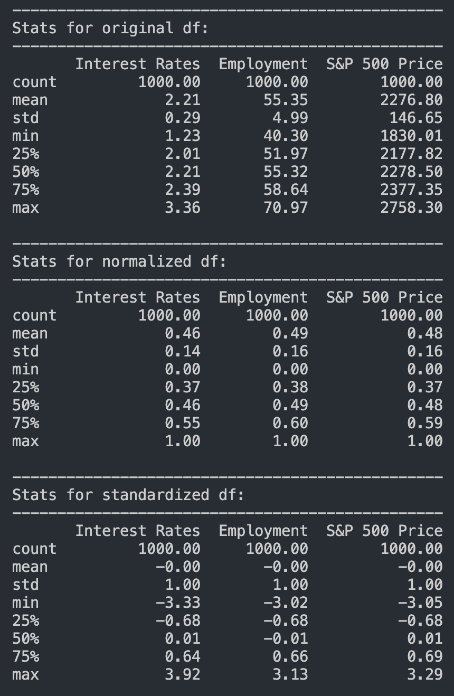

# Normalization-vs-Standardization
This project is inspired by Prof. Ryan Ahmed. He clearly explains what Normalization and Standardization do to a dataframe, so I highly recommend watching it.

Basically, the project contains simple 3-column generated data which you can find with the name `stock.csv`.

- We first extract the data from csv file and turn it into a dataframe. We describe the data and plot it as it is originally.
- Then we apply `MinMaxScaler()` to Normalize it, describe it, and plot the normalized dataframe.
- Lastly, we apply `StandardScaler()` to standardize it, describe it, and plot the standardized dataframe.

**Original DF plot:**  

**Normalized DF plot:**  

**Standardized DF plot:**  

**Quick Stat Chack:**
- Normalized values are only from 0 to 1
- Standardized dataframe mean is 0 with standard deviation of 1

---

## Use Normalization With
Algorithms that are sensitive to magnitude:

- Neural Networks / Deep Learning (sigmoid/tanh activations)  
- K-Nearest Neighbors (KNN)  
- K-Means clustering  

When you don’t care about the distribution being centered; only scale matters.

---

## Use Standardization With
Algorithms that assume normal distribution or care about variance:

- Linear Regression  
- Logistic Regression  
- SVM  
- PCA  
- Gaussian Naive Bayes  

Outliers exist → standardization is less affected by extreme values than normalization in some cases.

---

**Libraries Used:** Pandas, Matplotlib, Seaborn, SciKit-Learn  
**Source video link:** [YouTube](https://www.youtube.com/watch?v=bqhQ2LWBheQ&t=9s)
